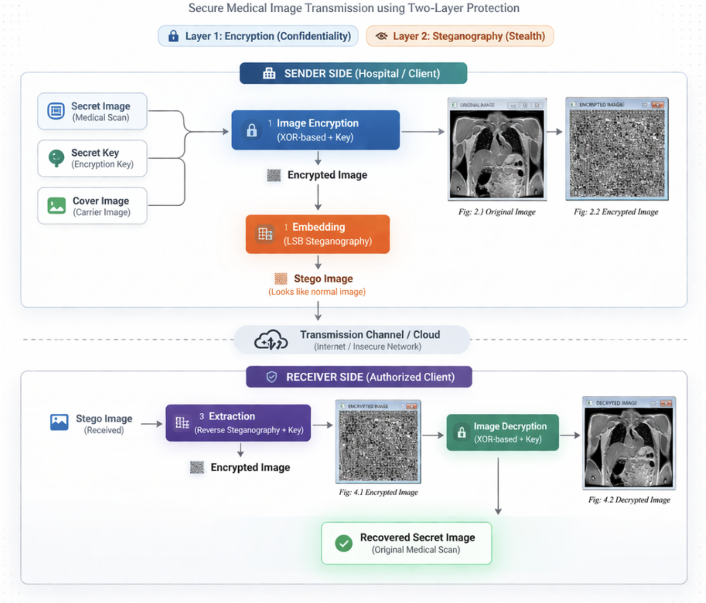
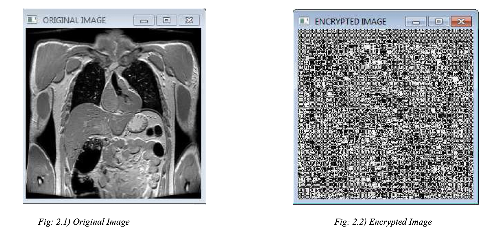
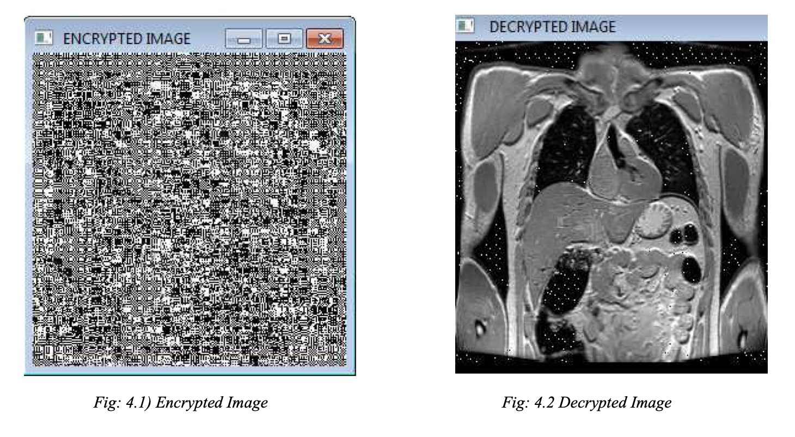

# Image Encryption and Image-to-Image Steganography

## Overview

This project presents a two-layer secure image transmission system that combines image encryption with image-to-image steganography. The goal is to protect sensitive visual data not only by making it unreadable, but also by concealing its very existence during transmission.

The system is designed around a simple but effective principle: first encrypt the image to ensure confidentiality, and then embed the encrypted image within another image to provide an additional layer of security through obscurity. This dual approach makes it significantly harder for unauthorized users to access or even detect the protected information.

---

## System Architecture

  

The system follows a structured pipeline consisting of two main phases: a sender-side process that encrypts and embeds the image, and a receiver-side process that extracts and decrypts it.

At the sender side, the original image is transformed into an encrypted representation using a key-based encryption mechanism. This encrypted output is then hidden inside a visually unrelated cover image using a steganographic embedding technique. The resulting image, known as the stego image, appears visually indistinguishable from a normal image and can be transmitted over public or insecure channels.

At the receiver side, the reverse process is applied. The hidden data is first extracted from the stego image using the same key, and then decrypted to recover the original image.

---

## Methodology

The implementation is built around a sequence of clearly defined operations that together ensure both security and recoverability.

The process begins with image encryption, where the original image is transformed using a key-based operation. In this project, encryption is implemented using a pixel-wise transformation (such as XOR with a key), which produces an encrypted image that appears as random noise and does not reveal any structural information about the original input.

Once encrypted, the image is passed into the embedding stage. Here, a Least Significant Bit (LSB) substitution technique is used to hide the encrypted image within a cover image. This method modifies only the least significant bits of the cover image pixels, ensuring that visual distortion remains minimal and the output image looks nearly identical to the original cover image.

The stego image is then transmitted through a communication channel, such as a network or cloud storage system.

On the receiving end, the embedded data is extracted using the same key. This step reverses the steganographic process and reconstructs the encrypted image. Finally, the encrypted image is decrypted using the corresponding key to recover the original image.

---

## Implementation Details

The project focuses on clarity and control over the underlying operations rather than relying heavily on high-level libraries.

Encryption and decryption are implemented using key-based transformations applied directly to image pixel values. The embedding process is carried out using LSB substitution, where binary data from the encrypted image is inserted into the least significant bits of the cover image.

The system ensures that:

- the encrypted image is visually unrecognizable  
- the stego image remains visually consistent with the cover image  
- the original image can be reconstructed with minimal loss when the correct key is used  

All transformations are deterministic, ensuring reproducibility and consistency across runs.

---

## Results

The results demonstrate the effectiveness of combining encryption and steganography as a two-layer security system.

The encrypted image appears as high-entropy noise, confirming that the original visual information is fully obscured. This ensures that even if the encrypted data is intercepted, it cannot be interpreted without the key.

  

After embedding, the stego image remains visually indistinguishable from the original cover image. This makes it difficult for an observer to detect that any hidden data exists within the image.

During extraction and decryption, the original image is successfully reconstructed. While minor noise artifacts may be present due to bit-level manipulation, the structural integrity of the image is preserved.

  

Overall, the system achieves both confidentiality and concealment, which are critical for secure data transmission.

---

## Key Insights

One of the key observations from this project is that encryption alone is not sufficient when the goal is to avoid detection. While encryption protects the content, it does not hide the presence of data. By combining encryption with steganography, the system ensures that both the content and the existence of the message are protected.

Another important insight is the trade-off between embedding capacity and image quality. While LSB substitution allows for efficient data hiding, excessive embedding can introduce visible distortions. Careful control of embedding depth is therefore necessary.

---

## Limitations

The current implementation uses relatively simple encryption and steganographic techniques. While effective for demonstration purposes, these methods may not be robust against advanced attacks or statistical detection techniques.

Additionally, the approach may introduce slight visual noise in the reconstructed image, especially when operating at higher embedding capacities.

---

## Future Work

Future improvements could focus on strengthening both layers of the system. More advanced encryption techniques can be introduced to improve resistance against cryptographic attacks. On the steganography side, adaptive or transform-domain methods could be explored to reduce detectability.

Another promising direction is extending the system to support text or multi-modal data embedding, as well as evaluating robustness against real-world compression and transmission noise.

---

## Conclusion

This project demonstrates a practical approach to secure image transmission by combining encryption and steganography into a unified pipeline. By layering these two techniques, the system provides both data confidentiality and concealment, making it significantly more secure than using either method in isolation.

The work highlights how relatively simple techniques, when combined thoughtfully, can produce a system that is both effective and conceptually robust.
